# gsuite-manager (`gsm`)

<p align="center">
  <picture>
    <source media="(prefers-color-scheme: dark)" srcset="docs/assets/logo-dark.svg">
    <source media="(prefers-color-scheme: light)" srcset="docs/assets/logo.svg">
    
  </picture>
</p>

<p align="center">
  <a href="https://github.com/nopperabbo/gsuite-manager/actions/workflows/ci.yml"></a>
  <a href="https://www.python.org/downloads/"></a>
  <a href="https://codecov.io/gh/nopperabbo/gsuite-manager"></a>
  <a href="LICENSE"></a>
  <a href="https://github.com/astral-sh/ruff"></a>
  <a href="https://mypy-lang.org/"></a>
</p>

<p align="center">
  <strong>Automate Google Workspace + Cloudflare in one CLI.</strong><br>
  Onboard domains, create users, manage DNS — idempotent, tested, production-ready.
</p>

<p align="center">
  <a href="docs/USAGE.md">Documentation</a> •
  <a href="CONTRIBUTING.md">Contributing</a> •
  <a href="https://github.com/nopperabbo/gsuite-manager/discussions">Discussions</a>
</p>

---

<!-- Hero terminal screenshot -->
<p align="center">
  
</p>

## Why gsuite-manager?

| | Manual (Admin Console + CF Dashboard) | gsuite-manager |
|---|---|---|
| Onboard 10 domains | ~2 hours clicking | `gsm domains add --file domains.txt` → 3 min |
| Create 50 users | Copy-paste hell | `gsm users gen --count 50 --apply` → 30 sec |
| Audit DNS health | Check each domain manually | `gsm health` → instant report |
| Rotate credentials | Remember where everything is | `gsm setup` → guided wizard |

**No SDK to learn. No YAML to write. No API docs to read.** Just `gsm` and pick a number.

## Features

| Feature | Description |
|---------|-------------|
| Domain onboarding | Add to Workspace → CF zone → DNS inject → verify (7-step pipeline, idempotent) |
| Auto-disable Email Routing | Detects CF Email Routing conflict, disables before MX inject |
| DNS propagation fix | Polls 8.8.8.8 + 1.1.1.1 before verify (eliminates race failures) |
| User management | Create, delete, suspend, reset password, aliases, groups, OU move |
| Auto-generate users | Faker-based, locale-aware, collision-safe, with license assignment |
| Audit & monitoring | CF vs Workspace gap, DNS health, domain expiry alerts |
| Interactive menu | Just type `gsm`, pick a number. No commands to memorize |
| Progress bar + ETA | Real-time progress for batch operations |
| Retry with backoff | CF API calls retry 3x on transient failures |
| Friendly errors | Technical errors translated to actionable hints |

## Quick Start

```bash
git clone https://github.com/nopperabbo/gsuite-manager.git
cd gsuite-manager
python3 -m venv .venv && source .venv/bin/activate
pip install -e .
gsm setup    # interactive wizard
gsm doctor   # verify 5/5 PASS
gsm          # open menu
```

<details>
<summary><b>Windows / Linux notes</b></summary>

| OS | Activate venv |
|---|---|
| macOS / Linux | `source .venv/bin/activate` |
| Windows CMD | `.venv\Scripts\activate.bat` |
| Windows PowerShell | `.venv\Scripts\Activate.ps1` |

**macOS Python 3.14:** Run `chflags -R nohidden .venv` after install.

**Linux:** If `venv` missing: `sudo apt install python3-venv`
</details>

## Examples

```bash
# Onboard domains (auto: Workspace + CF + DNS + verify)
gsm domains add --file domains.txt

# Auto-generate 50 users with Education license
gsm users gen --domain school.tech --count 50 --license education --apply

# Audit: what's in CF but not in Workspace?
gsm audit --output gaps.txt

# Reset all passwords in a domain
gsm users reset-password --domain old.tech --random --output new-creds.txt

# One command does everything (auto-detect files in CWD)
gsm go
```

## Prerequisites

- Python 3.11+
- Google Workspace admin account
- Cloudflare account with domains as zones
- [Google OAuth Desktop App credentials](docs/SETUP_GOOGLE_OAUTH.md)
- [Cloudflare API Token](https://dash.cloudflare.com/profile/api-tokens) (template: "Edit zone DNS")

## Documentation

| Doc | Description |
|---|---|
| [Usage Guide (English)](docs/USAGE.md) | Complete command reference |
| [Tutorial (Bahasa Indonesia)](docs/CARA_PAKE.md) | Full usage guide |
| [How to Test](docs/CARA_TEST.md) | Tier 1 smoke + Tier 2 real test |
| [Google OAuth Setup](docs/SETUP_GOOGLE_OAUTH.md) | Get credentials.json step-by-step |
| [CF Token Rotation](docs/QUICK_ROTATE_CF_TOKEN.md) | 3-minute token refresh |
| [Production Runbook](docs/PRODUCTION_RUNBOOK.md) | Pre-production checklist |
| [Roadmap](docs/ROADMAP.md) | Future phases |
| [Changelog](CHANGELOG.md) | Release history |
| [Contributing](CONTRIBUTING.md) | Dev setup & guidelines |

## Architecture

```
┌─────────────────────────────────────────────────────────────┐
│                        CLI Layer                             │
│  gsm menu │ gsm go │ gsm domains │ gsm users │ gsm groups  │
└─────────────────────────┬───────────────────────────────────┘
                          │
┌─────────────────────────▼───────────────────────────────────┐
│                    Workflow Layer                            │
│  domain_onboarding (7-step) │ user_bulk_create │ dns_apply  │
└─────────────────────────┬───────────────────────────────────┘
                          │
┌─────────────────────────▼───────────────────────────────────┐
│                    Client Layer                              │
│  Cloudflare API │ Google Admin SDK │ Google Verify │ DNS     │
│  (retry+backoff)│ (users/domains)  │ (site verify) │(dnspy) │
└─────────────────────────┬───────────────────────────────────┘
                          │
┌─────────────────────────▼───────────────────────────────────┐
│                     Core Layer                               │
│  config (pydantic) │ auth (OAuth2) │ errors │ logging       │
└─────────────────────────┬───────────────────────────────────┘
                          │
┌─────────────────────────▼───────────────────────────────────┐
│                   State Layer                                │
│  JSON Ledger (atomic writes, corrupt recovery, archive)     │
└─────────────────────────────────────────────────────────────┘
```

```
src/gsm/
├── cli/         # Typer commands + interactive menu
├── clients/     # CF, Google Admin, Google Verify, DNS, Faker
├── core/        # Config, OAuth, logging, error humanizer
├── models/      # Pydantic schemas (domain, user, results)
├── state/       # JSON ledger (atomic writes, corrupt recovery)
└── workflows/   # Domain onboarding, user creation orchestration
```

## FAQ

<details>
<summary><b>Is this safe for production?</b></summary>

Yes. All operations are idempotent (safe to re-run), use atomic writes for state, and include dry-run mode. The tool has 90%+ test coverage with strict type checking.
</details>

<details>
<summary><b>Does it work on Windows?</b></summary>

Yes. CI runs on Ubuntu, macOS, and Windows. Use PowerShell for activation: `.venv\Scripts\Activate.ps1`
</details>

<details>
<summary><b>Can I use this without Cloudflare?</b></summary>

Partially. User management commands (`gsm users *`, `gsm groups *`) work with just Google Workspace. Domain onboarding and DNS features require Cloudflare.
</details>

<details>
<summary><b>How do I pronounce "gsm"?</b></summary>

"gee-ess-em" — the CLI command. The full project name is "gsuite-manager" (gee-suite manager).
</details>

<details>
<summary><b>What Google API scopes are required?</b></summary>

Only 3 scopes: `admin.directory.user`, `admin.directory.group`, `admin.directory.domain` — minimized for security.
</details>

## License

[MIT](LICENSE) © nopperabbo
